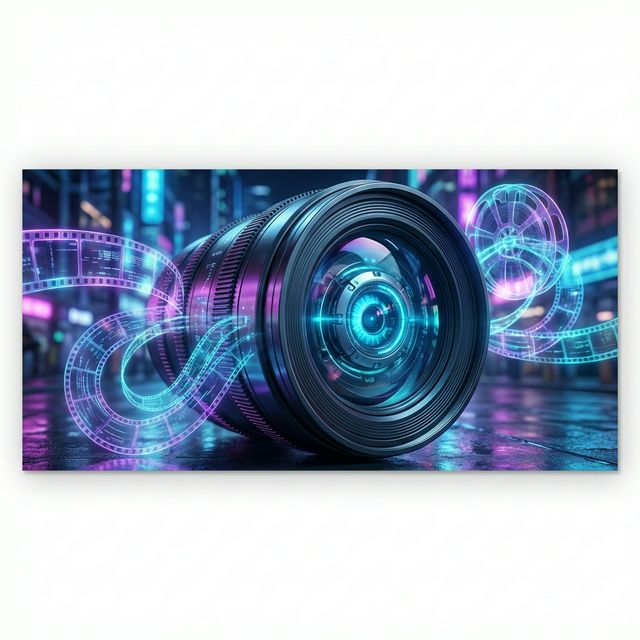
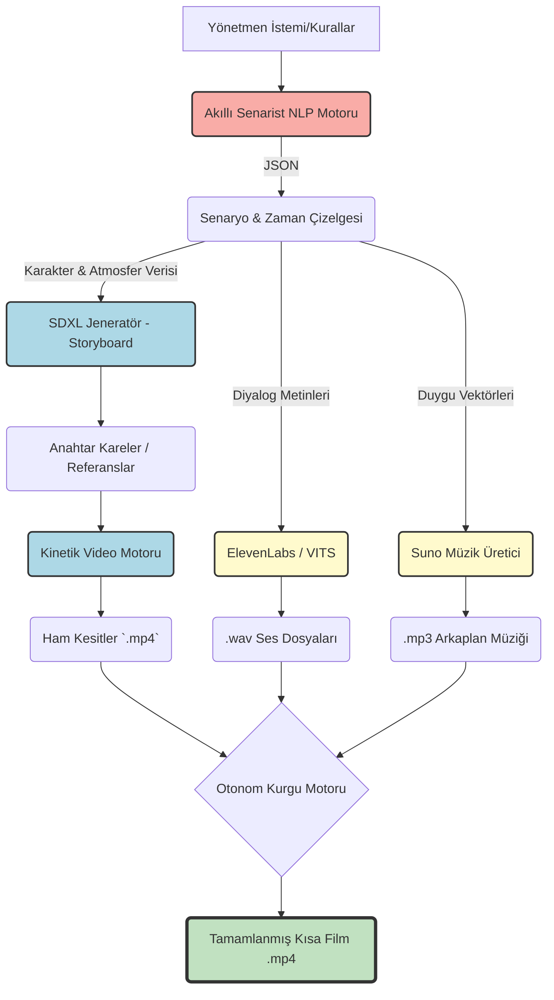



# 🎬 TEKNOFEST 2025: Yapay Zeka ile Sinema ve Medya Sanatları

<div align="center">
  
  [](https://github.com/bahattinyunus/teknofest_yapay_zeka_film/actions/workflows/lint.yml)
  [](https://github.com/bahattinyunus/teknofest_yapay_zeka_film/actions/workflows/tests.yml)
  [](Dockerfile)
  [](https://github.com/bahattinyunus)
  [](https://github.com/bahattinyunus)
  [](LICENSE)
  
  ```text
   ________  ________  ___  ___  ________  ________  _____ ______      
  |\   __  \|\   __  \|\  \|\  \|\   __  \|\   __  \|\   _ \  _   \    
  \ \  \|\  \ \  \|\  \ \  \\\  \ \  \|\  \ \  \|\  \ \  \\\__\ \  \   
   \ \   ____\ \   _  _\ \  \\\  \ \  \\\  \ \  \\\  \ \  \\|__| \  \  
    \ \  \___|\ \  \\  \\ \  \\\  \ \  \\\  \ \  \\\  \ \  \    \ \  \ 
     \ \__\    \ \__\\ _\\ \_______\ \_______\ \_______\ \__\    \ \__\
      \|__|     \|__|\|__|\|_______|\|_______|\|_______|\|__|     \|__|
                                                                       
            ::: ARTIFICIAL INTELLIGENCE CINEMATIC UNIVERSE :::
  ```

  **"Geleneksel Sinemanın Sınırlarını Algoritmalarla Aşmak"**
</div>

---

## 🌍 Proje Vizyonu ve Özgünlük (TEKNOFEST Odaklı)

TEKNOFEST 2025 "Eğitim Teknolojileri / Sanatta Yapay Zeka" vizyonu doğrultusunda geliştirilen bu proje, **sinematografik üretim süreçlerini** uçtan uca otonomlaştıran akıllı bir dijital stüdyo altyapısıdır. 

Sadece mevcut üretken yapay zeka (Generative AI) araçlarını bir araya getirmekle kalmaz; asıl katma değeri, büyük dil modelleri (LLM), görüntü difüzyon modelleri (Diffusion Models) ve nöral ses sentezleyicilerini **entegre bir veri boru hattında (data pipeline)** ahenk içinde çalıştıran bir **"Orkestrasyon Motoru"** tasarlamasıdır. 

Amacımız, dev bütçeli prodüksiyon şirketlerinin tekelinde olan nitelikli görsel-işitsel eser üretimini, yerli, esnek ve bağımsız içerik üreticileri için erişilebilir (*demokratize*) kılmaktır.

---

## 🧠 Çekirdek Modüller ve Mimari

Sistem, geleneksel film yapımındaki rolleri (Senarist, Yönetmen, Montajcı vb.) üstlenen modüler yapay zeka ajanlarından oluşur:

### 1. Bilişsel Çekirdek: "Akıllı Senarist" (Cognitive Core)
*   Gelişmiş LLM'ler (örn: Llama-3, GPT-4o) kullanılarak temel bir promottan yapısal (Üç Perde, Kahramanın Yolculuğu) senaryolar üretir.
*   Diyalogların duygu analizini (Sentiment Analysis) yapar ve sahnenin "Tansiyon Vektörü"nü hesaplar.

### 2. Görsel Motor: "AI Sinematograf" (Vision Engine)
*   Senaryodaki çevresel betimlemeleri, ışık (Lighting - e.g., low-key, cyberpunk) ve kamera (Lens - e.g., 50mm, anamorphic) parametrelerine çevirir.
*   Difüzyon modellerine (Stable Diffusion XL, Midjourney) optimize edilmiş sarmal (iterative) promptlar göndererek tutarlı karakter tasarımları ve *storyboard*'lar oluşturur.
*   Kinetik entegrasyon ile (Runway/Sora API veya yerel AnimateDiff) durgun sahneleri canlandırır.

### 3. Akustik Sistem: "Nöral Reji" (Acoustic System)
*   Metin-Ses (TTS) dönüşümü sırasında karakterin anlık duygu durumuna göre sesteki frekans ve vurguyu (prosody) modüle eder.
*   Sahnenin uzunluk ve atmosferine dinamik olarak uyum sağlayan otonom jeneratif film müzikleri sentezler.

### 4. Kurgu Yöneticisi: "Otonom Montaj" (Autonomous Editor)
*   Görsel frameleri ve ses dalgalarını analiz eder (Optical Flow & Audio Beat Detection).
*   Sahneleri ritme göre kesip biçer (Hard cut, Crossfade, J-cut, L-cut) ve Python altyapısı (MoviePy/FFmpeg) ile render alır.

---

## 🛠 Kullanılan Teknolojiler

Projemiz, endüstri standardı açık kaynak kodlu kütüphaneler ile modern API'lerin bir sentezidir:

| Katman | Teknoloji / Çerçeve | Projedeki İşlevi |
| :--- | :--- | :--- |
| **Dil ve Veri İşleme** | `Python 3.10`, `LangChain`, `Pydantic` | Ana entegrasyon dili, ajan yönetimi, veri validasyonu |
| **Senaryo ve Prompt** | (Yerel) `Llama-3` / (Bulut) `OpenAI API` | Metinsel içerik, meta-prompt oluşturma ve yapılandırma |
| **Görsel Üretim** | `Stable Diffusion XL`, `ControlNet` | Lokal ortamda tutarlı karakter ve arkaplan üretimi |
| **Video ve Animasyon** | `AnimateDiff`, `Runway API` | Referans fotoğrafların sinematik kamerayla hareketlendirilmesi|
| **Kurgu ve Montaj** | `MoviePy`, `FFmpeg`, `OpenCV` | İşlenmemiş (Raw) dosyaları birleştirip çıktı (Render) alma |

---

## ⚙️ Sistem İstekleri

Geliştirici ortamının sorunsuz çalışması için asgari gereksinimler:

*   **OS:** Windows 10/11, Ubuntu 22.04 LTS veya macOS (M Serisi)
*   **CPU:** Çok çekirdekli güncel bir işlemci (Intel i7/Ryzen 7)
*   **RAM:** 16 GB (Lokal büyük modeller için 32 GB+ önerilir)
*   **GPU:** Yerel görüntü işleme (Stable Diffusion) için min. 8 GB VRAM alanına sahip Nvidia CUDA destekli donanım.
*   *Not: Sadece lokal değil, bulut/API odaklı çalışılıyorsa güçlü bir GPU şart değildir.*

---

## 🚀 Başlatma ve Kullanım (Execution)

Sistemi yerel makinenizde veya Docker üzerinde çalıştırabilirsiniz.

### 1. Komut Satırı Arayüzü (CLI)
Proje, terminalden doğrudan yönetilebilen gelişmiş bir CLI arayüzüne sahiptir:

```bash
# Temel kullanım (Yeni bir film başlat)
python main.py --prompt "Cyberpunk bir dünyada uyanan son insan"

# Gelişmiş kullanım (Çıktı ismi ve hata ayıklama modu)
python main.py --prompt "Antik Mısır'da dijital piramitler" --output antik_film.mp4 --debug
```

### 2. Docker ile Çalıştırma
Hiçbir bağımlılıkla uğraşmadan sistemi Docker üzerinden ayağa kaldırabilirsiniz:

```bash
# Docker imajını oluşturun
docker build -t ai-film .

# Konteynerı çalıştırın
docker run --env-file .env -v $(pwd)/outputs:/app/outputs ai-film --prompt "Sonsuz bir kütüphanede kaybolan AI"
```

### 3. Docker Compose (Orkestrasyon)
Birden fazla varyasyon denemek için `docker-compose.yml` dosyasını kullanabilirsiniz:
```bash
docker-compose up --build
```

---

## ⚙️ Kurulum Protokolü (Local Setup)

### Git ve Sanal Ortam
```bash
# Projeyi Klonlayın
git clone https://github.com/bahattinyunus/teknofest_yapay_zeka_film.git
cd teknofest_yapay_zeka_film

# Python sanal ortamı oluşturun ve aktifleştirin
python -m venv venv
# Windows:
.\venv\Scripts\activate
# Linux/macOS:
source venv/bin/activate
```

### Bağımlılıkların Yüklenmesi
```bash
# Gereksinimleri yükleyin
pip install --upgrade pip
pip install -r requirements.txt
```

### Konfigürasyon ve Güvenlik
Proje, güvenlik gereği `.env` soyutlaması kullanır. Api anahtarlarınızı repoya hiçbir zaman *pushlamayın*.
```bash
# Örnek konfigürasyon dosyasını kopyalayın
cp .env.example .env

# '.env' dosyasını açıp kendi API anahtarlarınızı girin (OPENAI_API_KEY, vs.)
```

---

## 🎬 Boru Hattı Akış Şeması (Pipeline Diagram)

Sistemdeki verinin girdi anından (prompt) çıktı anına (.mp4) kadarki yolculuğu:



---

## 📂 Yazılım Mimarisi (Directory Layout)

Proje kaynak koda modülerliği koruyan klasik bir paket yapısında düzenlenmiştir:

```text
teknofest_yapay_zeka_film/
├── 📂 assets/                    # Bannerlar, logolar ve sabit UI ikonlar
├── 📂 docs/                      # Mimari kararlar, matematik modelleri (örn: MATH_MODELS.md)
├── 📂 data/                      # Sentetik senaryo datasetleri (fine-tuning için)
├── 📂 src/                       # Sistemin çekirdek uygulama modülleri
│   ├── 🛠️ core/                  # Çevresel değişkenler, loglama mekanizmaları
│   ├── 📝 script_engine/         # LLM bazlı senaryo ve meta-prompt üreticileri
│   ├── 🎨 vision_engine/         # Text-to-Image ve Text-to-Video API entegrasyonları
│   ├── 🔊 audio_engine/          # Ses sentezi ve frekans analizi
│   └── 🎬 compositor/            # Zaman eksenli (timeline) render ve montaj sınıfı
├── 📂 outputs/                   # Sistemin çalışma asında ürettiği ara veriler ve son ürün
├── 📜 .env.example               # Çevresel değişken şablonu
├── 📜 requirements.txt           # Bağımlılık manifestosu
├── 📜 CONTRIBUTING.md            # Geliştiriciler için kod standartları rehberi
└── 📜 README.md                  # Proje ana komuta merkezi
```

---

## 📈 Başarı Kriterleri ve TEKNOFEST Beklentileri

*   **Otonomi:** İnsan müdahalesini sadece "yönlendirme" seviyesine indirgemek.
*   **Tutarlılık (Consistency):** Sahneler arası karakter görünümlerinin istikrarı.
*   **Performans:** Sistemdeki boru hattının (pipeline) olabildiğince az API çağrısıyla hızlı ve maliyetsiz render alabilmesi.
*   **Modülerlik:** Herhangi bir API'nin (örn: OpenAI yerine Llama) *plug-in* tarzında kolayca değişebilmesi (Gevşek Bağlı - Loosely Coupled mimari).

---

## 🤝 Katkıda Bulunma (Contributing)

[CONTRIBUTING.md](CONTRIBUTING.md) belgesi, kod standartları (PEP-8, tip ipuçları vb.) ve *Pull Request* gönderme süreçlerini içerir. Yeni difüzyon modelleri veya render algoritmaları entegre etmek isteyen geliştiricilerin katkılarına açığız.

---

## 👥 Tasarımcı ve Geliştirici Sistem Mimarı

<div align="center">

**Bahattin Yunus Çetin**

[](https://github.com/bahattinyunus)
[](https://linkedin.com/in/bahattinyunus)

</div>

## ⚖️ Lisans Şartları

Özgür yazılım ruhunu desteklediğimiz bu repo, tam teşekküllü kullanım için [MIT Lisansı](LICENSE) kapsamında açık kaynak olarak yayımlanmıştır. Kullanılan bağımlı LLM ve Generative hizmetlerinin telifleri ilgili şirketlere aittir.

---
<div align="center">
  <i>💡 TEKNOFEST 2025: Geleceğin Yönetmen Koltuğu - Bir Mühendislik Sanatı 💡</i>
</div>