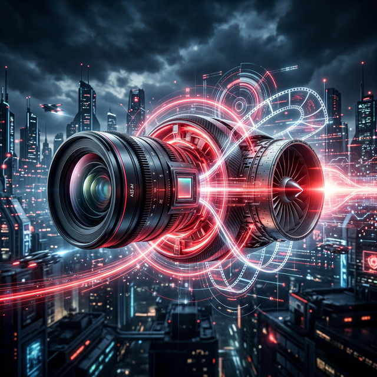
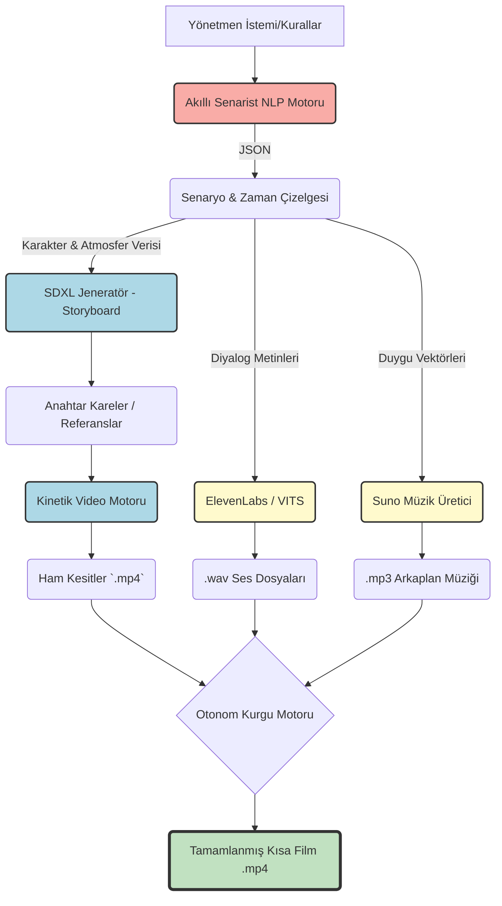



# 🎬 TEKNOFEST 2025: Yapay Zeka ile Sinema ve Medya Sanatları

<div align="center">
  
  [](https://github.com/bahattinyunus/teknofest_yapay_zeka_film/actions/workflows/lint.yml)
  [](https://github.com/bahattinyunus/teknofest_yapay_zeka_film/actions/workflows/tests.yml)
  [](Dockerfile)
  [](https://github.com/bahattinyunus)
  [](https://github.com/bahattinyunus)
  [](LICENSE)
  
  ```text
   ________  ________  ___  ___  ________  ________  _____ ______      
  |\   __  \|\   __  \|\  \|\  \|\   __  \|\   __  \|\   _ \  _   \    
  \ \  \|\  \ \  \|\  \ \  \\\  \ \  \|\  \ \  \|\  \ \  \\\__\ \  \   
   \ \   ____\ \   _  _\ \  \\\  \ \  \\\  \ \  \\\  \ \  \\|__| \  \  
    \ \  \___|\ \  \\  \\ \  \\\  \ \  \\\  \ \  \\\  \ \  \    \ \  \ 
     \ \__\    \ \__\\ _\\ \_______\ \_______\ \_______\ \__\    \ \__\
      \|__|     \|__|\|__|\|_______|\|_______|\|_______|\|__|     \|__|
                                                                       
            ::: ARTIFICIAL INTELLIGENCE CINEMATIC UNIVERSE :::
  ```

  **"Geleneksel Sinemanın Sınırlarını Algoritmalarla Aşmak"**
</div>

---

## 🌐 Küresel Kıyaslamalar ve Endüstriyel İlham Kaynakları

Bu proje, sadece yerel bir başarı hedeflemekle kalmayıp, dünyadaki öncü yapay zeka film festivallerinden, Hollywood standartlarındaki prodüksiyon teknolojilerinden ve açık kaynaklı "State-of-the-Art" (SOTA) projelerinden ilham alarak küresel bir vizyonla geliştirilmektedir. Aşağıdaki tablolar, projemizin hangi teknolojik ve sanatsal ekosistemlerin bir parçası olarak konumlandığını ve gelişim sürecinde hangi devasa altyapıları referans aldığını göstermektedir.

### 🏆 Uluslararası AI Film Yarışmaları ve Festivaller
| Yarışma / Festival | Kapsam | Bağlantı |
| :--- | :--- | :--- |
| **Global AI Film Award** | 1 Milyar Takipçi Zirvesi kapsamında düzenlenen 1 milyon dolar ödüllü yarışma. | [Web Sitesi](https://1billionsummit.com/) |
| **Runway AI Film Festival** | Üretken yapay zekanın sinemadaki en prestijli küresel festivali. | [Web Sitesi](https://aiff.runwayml.com/) |
| **Reply AI Film Festival** | Sentetik hikaye anlatıcılığına odaklanan uluslararası yarışma. | [Web Sitesi](https://www.reply.com/ai-film-festival) |
| **AI for Good Film Festival** | BM destekli, sosyal etki odaklı yapay zeka film festivali. | [Web Sitesi](https://aiforgood.itu.int/film-festival/) |
| **K-AIFF** | Kore Uluslararası Yapay Zeka Film Festivali. | [Web Sitesi](https://kaiff.kr/) |

### 🛠️ Açık Kaynaklı State-of-the-Art (SOTA) Projeler
| Proje İsmi | Öne Çıkan Özellik | Kaynak Kod (GitHub) |
| :--- | :--- | :--- |
| **HunyuanVideo** | Tencent'in 13 milyar parametreli ileri düzey video modeli. | [Tencent/HunyuanVideo](https://github.com/Tencent/HunyuanVideo) |
| **Wan2.1** | Açık kaynaklı en güçlü video üretim suitlerinden biri. | [Wan-Video/WanVideo](https://github.com/Wan-Video/WanVideo) |
| **Open-Sora** | Sinematik kalitede video üretimi sağlayan açık kaynaklı altyapı. | [hpcaitech/Open-Sora](https://github.com/hpcaitech/Open-Sora) |
| **LTX-Video** | Düşük VRAM kullanımı ve ses senkronizasyonu ile öne çıkan model. | [Lightricks/LTX-Video](https://github.com/Lightricks/LTX-Video) |
| **SkyReels-V2** | Sonsuz uzunlukta film üretim mimarisi sunan açık kaynaklı proje. | [SkyReels/SkyReels-V2](https://github.com/SkyReels/SkyReels-V2) |
| **ComfyUI** | AI medya üretimi için endüstri standardı olan düğüm tabanlı iş akışı. | [comfyanonymous/ComfyUI](https://github.com/comfyanonymous/ComfyUI) |

---

## 🌍 Proje Vizyonu ve Özgünlük (TEKNOFEST Odaklı)

TEKNOFEST 2025 "Eğitim Teknolojileri / Sanatta Yapay Zeka" vizyonu doğrultusunda titizlikle kurgulanan bu proje, **sinematografik üretim süreçlerini** uçtan uca otonomlaştıran, modüler ve yüksek performanslı bir dijital stüdyo altyapısıdır. Geleneksel sinemanın insan gücüne dayalı, yüksek maliyetli ve zaman alıcı süreçlerini algoritmik bir düzleme taşıyarak, yaratıcılığı statik bir sonuçtan dinamik bir sürece dönüştürmeyi amaçlamaktayız.

Sistemimiz, piyasadaki mevcut üretken yapay zeka (Generative AI) araçlarını basit bir arayüzde bir araya getiren bir "araç seti" olmanın çok ötesindedir. Projenin asıl mühendislik katma değeri; büyük dil modelleri (LLM), görüntü difüzyon modelleri (Diffusion Models) ve karmaşık nöral ses sentezleyicilerini **entegre bir veri boru hattında (data pipeline)** tam bir uyum içinde çalıştıran, hata toleranslı ve ölçeklenebilir bir **"Orkestrasyon Motoru"** (Orchestration Engine) mimarisi sunmasıdır. 

Vizyonumuz, sinema sanatını sadece büyük bütçeli stüdyoların ayrıcalığı olmaktan çıkarıp, bağımsız yönetmenlerin, eğitimcilerin ve dijital sanatçıların hayal güçlerini en yüksek teknik standartlarda gerçeğe dönüştürebilecekleri **demokratik bir üretim ekosistemi** inşa etmektir.

---

## 🧠 Çekirdek Modüller ve Mimari

Sistem, geleneksel bir film setindeki hiyerarşik rolleri (Senarist, Yönetmen, Görüntü Yönetmeni, Ses Tasarımcısı ve Montajcı) üstlenen, birbirleriyle asenkron olarak haberleşebilen modüler yapay zeka ajanlarından ve motorlarından oluşmaktadır:

### 1. Bilişsel Çekirdek: "Akıllı Senarist" (Cognitive Core)
*   **Narrative Synthesis:** Gelişmiş LLM'ler (Llama-3, GPT-4o vb.) üzerinden, kullanıcının vizyonunu yapısal bir senaryoya dönüştürür. Üç perdelik yapı, dramatik ark ve karakter gelişimi algoritmik olarak denetlenir.
*   **Sentiment & Context Analysis:** Senaryodaki her bir diyalog ve sahne betimlemesi üzerinde duygu analizi gerçekleştirerek, sahnenin "Tansiyon Vektörü"nü belirler. Bu veri, bir sonraki aşamada ses tonlaması ve müzik seçimini doğrudan yönlendirir.

### 2. Görsel Motor: "AI Sinematograf" (Vision Engine)
*   **Cinematic Prompt Engineering:** Senaryodaki edebi metni, teknik kamera parametrelerine (Lighting, Frame Composition, Lens Aperture) tercüme eder. Siberpunk atmosferden neo-realist ışıklandırmaya kadar geniş bir spektrumda görsel stil tutarlılığı sağlar.
*   **Iterative Diffusion:** Difüzyon modellerini kullanarak, karakterlerin fiziksel özelliklerini (consistency) koruyan storyboard'lar ve anahtar kareler üretir.
*   **Kinetic Motion Synthesis:** Üretilen statik kareleri, optik akış ve derinlik haritası analiziyle sinematik hareketlere (Pan, Tilt, Zoom) dönüştürerek canlı sahneler inşa eder.

### 3. Akustik Sistem: "Nöral Reji" (Acoustic System)
*   **Prosody Modeling:** Metin-Ses (TTS) dönüşümünde karakterin sahnedeki psikolojik durumuna göre vurgu, nefes payı ve ses frekansını dinamik olarak ayarlar.
*   **Atmospheric Scoring:** Sahnenin görsel ritmine ve duygu yoğunluğuna anlık olarak tepki veren, telif sorunu olmayan jeneratif atmosferik müzikler ve ses efektleri (SFX) üretir.

### 4. Kurgu Yöneticisi: "Otonom Montaj" (Autonomous Editor)
*   **Algorithmic Cutting:** Görsel sahneleri ve ses kanallarını saniyenin binde biri hassasiyetinde analiz eder. Müzik ritmi (Beat Detection) ve sahne içi hareket ivmesine göre en estetik kesme noktalarını belirler.
*   **Post-Production Pipeline:** MoviePy ve FFmpeg motorlarını kullanarak renk düzenleme (Color Grading), geçiş efektleri ve final render işlemlerini otonom olarak tamamlar.

---

## 🛠 Kullanılan Teknolojiler

Projemiz, endüstri standardı açık kaynak kodlu kütüphaneler ile modern API'lerin bir sentezidir:

| Katman | Teknoloji / Çerçeve | Projedeki İşlevi |
| :--- | :--- | :--- |
| **Dil ve Veri İşleme** | `Python 3.10`, `LangChain`, `Pydantic` | Ana entegrasyon dili, ajan yönetimi, veri validasyonu |
| **Senaryo ve Prompt** | (Yerel) `Llama-3` / (Bulut) `OpenAI API` | Metinsel içerik, meta-prompt oluşturma ve yapılandırma |
| **Görsel Üretim** | `Stable Diffusion XL`, `ControlNet` | Lokal ortamda tutarlı karakter ve arkaplan üretimi |
| **Video ve Animasyon** | `AnimateDiff`, `Runway API` | Referans fotoğrafların sinematik kamerayla hareketlendirilmesi|
| **Kurgu ve Montaj** | `MoviePy`, `FFmpeg`, `OpenCV` | İşlenmemiş (Raw) dosyaları birleştirip çıktı (Render) alma |

---

## ⚙️ Sistem İstekleri

Geliştirici ortamının sorunsuz çalışması için asgari gereksinimler:

*   **OS:** Windows 10/11, Ubuntu 22.04 LTS veya macOS (M Serisi)
*   **CPU:** Çok çekirdekli güncel bir işlemci (Intel i7/Ryzen 7)
*   **RAM:** 16 GB (Lokal büyük modeller için 32 GB+ önerilir)
*   **GPU:** Yerel görüntü işleme (Stable Diffusion) için min. 8 GB VRAM alanına sahip Nvidia CUDA destekli donanım.
*   *Not: Sadece lokal değil, bulut/API odaklı çalışılıyorsa güçlü bir GPU şart değildir.*

---

## 🚀 Başlatma ve Kullanım (Execution)

Sistemi yerel makinenizde veya Docker üzerinde çalıştırabilirsiniz.

### 1. Komut Satırı Arayüzü (CLI)
Proje, terminalden doğrudan yönetilebilen gelişmiş bir CLI arayüzüne sahiptir:

```bash
# Temel kullanım (Yeni bir film başlat)
python main.py --prompt "Cyberpunk bir dünyada uyanan son insan"

# Gelişmiş kullanım (Çıktı ismi ve hata ayıklama modu)
python main.py --prompt "Antik Mısır'da dijital piramitler" --output antik_film.mp4 --debug
```

### 2. Docker ile Çalıştırma
Hiçbir bağımlılıkla uğraşmadan sistemi Docker üzerinden ayağa kaldırabilirsiniz:

```bash
# Docker imajını oluşturun
docker build -t ai-film .

# Konteynerı çalıştırın
docker run --env-file .env -v $(pwd)/outputs:/app/outputs ai-film --prompt "Sonsuz bir kütüphanede kaybolan AI"
```

### 3. Docker Compose (Orkestrasyon)
Birden fazla varyasyon denemek için `docker-compose.yml` dosyasını kullanabilirsiniz:
```bash
docker-compose up --build
```

---

## ⚙️ Kurulum Protokolü (Local Setup)

### Git ve Sanal Ortam
```bash
# Projeyi Klonlayın
git clone https://github.com/bahattinyunus/teknofest_yapay_zeka_film.git
cd teknofest_yapay_zeka_film

# Python sanal ortamı oluşturun ve aktifleştirin
python -m venv venv
# Windows:
.\venv\Scripts\activate
# Linux/macOS:
source venv/bin/activate
```

### Bağımlılıkların Yüklenmesi
```bash
# Gereksinimleri yükleyin
pip install --upgrade pip
pip install -r requirements.txt
```

### Konfigürasyon ve Güvenlik
Proje, güvenlik gereği `.env` soyutlaması kullanır. Api anahtarlarınızı repoya hiçbir zaman *pushlamayın*.
```bash
# Örnek konfigürasyon dosyasını kopyalayın
cp .env.example .env

# '.env' dosyasını açıp kendi API anahtarlarınızı girin (OPENAI_API_KEY, vs.)
```

---

## 🎬 Boru Hattı Akış Şeması (Pipeline Diagram)

Sistemdeki verinin girdi anından (prompt) çıktı anına (.mp4) kadarki yolculuğu:



---

## 📂 Yazılım Mimarisi (Directory Layout)

Proje kaynak koda modülerliği koruyan klasik bir paket yapısında düzenlenmiştir:

```text
teknofest_yapay_zeka_film/
├── 📂 assets/                    # Bannerlar, logolar ve sabit UI ikonlar
├── 📂 docs/                      # Mimari kararlar, matematik modelleri (örn: MATH_MODELS.md)
├── 📂 data/                      # Sentetik senaryo datasetleri (fine-tuning için)
├── 📂 src/                       # Sistemin çekirdek uygulama modülleri
│   ├── 🛠️ core/                  # Çevresel değişkenler, loglama mekanizmaları
│   ├── 📝 script_engine/         # LLM bazlı senaryo ve meta-prompt üreticileri
│   ├── 🎨 vision_engine/         # Text-to-Image ve Text-to-Video API entegrasyonları
│   ├── 🔊 audio_engine/          # Ses sentezi ve frekans analizi
│   └── 🎬 compositor/            # Zaman eksenli (timeline) render ve montaj sınıfı
├── 📂 outputs/                   # Sistemin çalışma asında ürettiği ara veriler ve son ürün
├── 📜 .env.example               # Çevresel değişken şablonu
├── 📜 requirements.txt           # Bağımlılık manifestosu
├── 📜 CONTRIBUTING.md            # Geliştiriciler için kod standartları rehberi
└── 📜 README.md                  # Proje ana komuta merkezi
```

---

## 📈 Başarı Kriterleri ve TEKNOFEST Beklentileri

Projemizin başarısı, sadece teknik bir çıktı üretmekle değil, sinema endüstrisinin geleceğine yön verecek aşağıdaki dört temel kriterle ölçülmektedir:

*   **🌐 Tam Otonomi (Full Autonomy):** İnsan müdahalesini "yaratıcı direktör" seviyesine indirgeyerek, operasyonel iş yükünü tamamen algoritmik sistemlere devretmek.
*   **🎞️ Görsel Tutarlılık (Visual Consistency):** Yapay zeka videolarındaki en büyük sorun olan karakter ve mekan değişimlerini (flickering), ileri düzey difüzyon teknikleriyle engelleyerek profesyonel bir seyir zevki sunmak.
*   **⚡ Hesaplama Verimliliği (Performance):** Karmaşık boru hattını optimize ederek, en az kaynak tüketimiyle yüksek çözünürlüklü ve akıcı "master" çıktılar üretebilmek.
*   **🔌 Modülerlik ve Gelecek Uyumluluğu:** Sistemin gevşek bağlı (Loosely Coupled) mimarisi sayesinde, yarın çıkacak bir SOTA modelini (örn: Sora v2) sisteme bir eklenti (plug-in) gibi dakikalar içinde entegre edebilmek.

---

## 🤝 Katkıda Bulunma (Contributing)

[CONTRIBUTING.md](CONTRIBUTING.md) belgesi, kod standartları (PEP-8, tip ipuçları vb.) ve *Pull Request* gönderme süreçlerini içerir. Yeni difüzyon modelleri veya render algoritmaları entegre etmek isteyen geliştiricilerin katkılarına açığız.

---

## 👥 Tasarımcı ve Geliştirici Sistem Mimarı

<div align="center">

**Bahattin Yunus Çetin**

[](https://github.com/bahattinyunus)
[](https://linkedin.com/in/bahattinyunus)

</div>

## ⚖️ Lisans Şartları

Özgür yazılım ruhunu desteklediğimiz bu repo, tam teşekküllü kullanım için [MIT Lisansı](LICENSE) kapsamında açık kaynak olarak yayımlanmıştır. Kullanılan bağımlı LLM ve Generative hizmetlerinin telifleri ilgili şirketlere aittir.

---
<div align="center">
  <i>💡 TEKNOFEST 2025: Geleceğin Yönetmen Koltuğu - Bir Mühendislik Sanatı 💡</i>
</div>