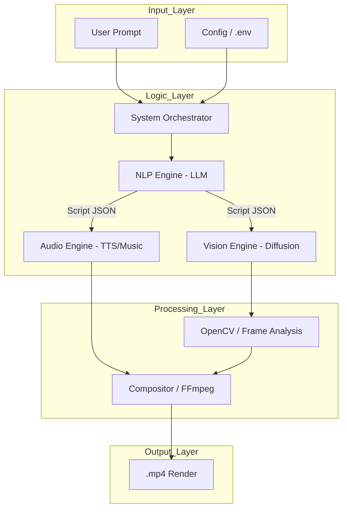

# Technical Architecture: AI Cinematic Universe

This document provides a deep dive into the technical orchestration and data flow of the project.

## 🏗 High-Level Orchestration

The system follows a modular "Orchestration" design pattern, where a central controller manages multiple independent AI agents.

## 🧠 Module Details

### 1. NLP Engine (Cognitive Core)
- **Primary Model:** Llama-3 / GPT-4o
- **Responsibility:** Parses creative intent into structured JSON metadata (scenes, characters, moods, dialogue).
- **Optimization:** Utilizes chain-of-thought prompting to ensure narrative consistency.

### 2. Vision Engine (Visual Synthesis)
- **Primary Model:** Stable Diffusion XL / Runway Gen-3
- **Responsibility:** Generates visual assets. 
- **Consistency:** Implements LoRA or IP-Adapter techniques to maintain character/environment stability across shots.

### 3. Audio Engine (Acoustic Synthesis)
- **Primary Model:** ElevenLabs / VITS
- **Responsibility:** High-fidelity voice synthesis with emotional inflection mapping.

### 4. Compositor (The Editor)
- **Tech:** Python, FFmpeg, MoviePy
- **Responsibility:** Algorithmic assembly of video, audio, and background music based on the timing metadata from the NLP Engine.

## 🔄 Data Lifecycle
1. **Ingestion:** Raw prompt is normalized.
2. **Expansion:** LLM creates a detailed multi-scene screenplay.
3. **Parallel Generation:** Visuals and Audio are generated asynchronously.
4. **Validation:** Frame count and audio sync are checked.
5. **Synthesis:** FFmpeg overlays tracks and performs color grading.
6. **Finalization:** Export of cinematic product.
